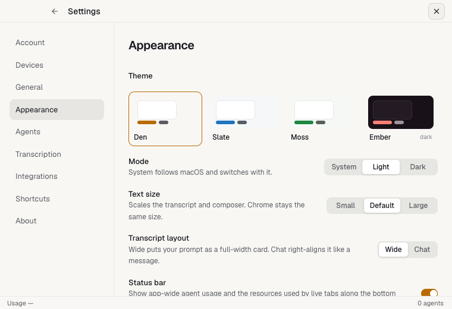
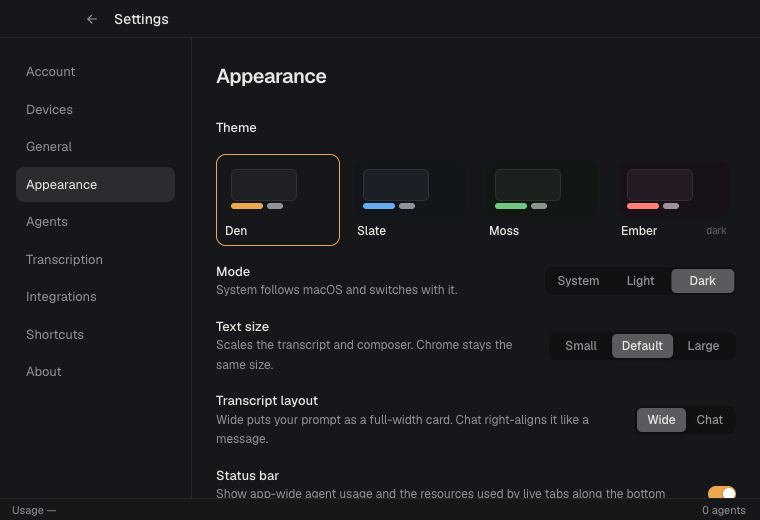
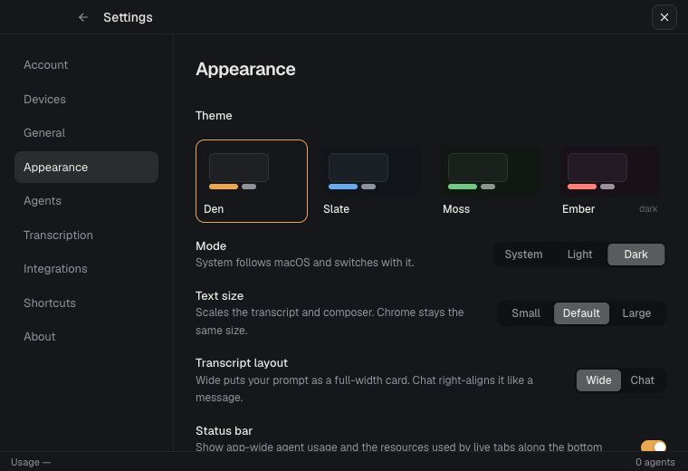
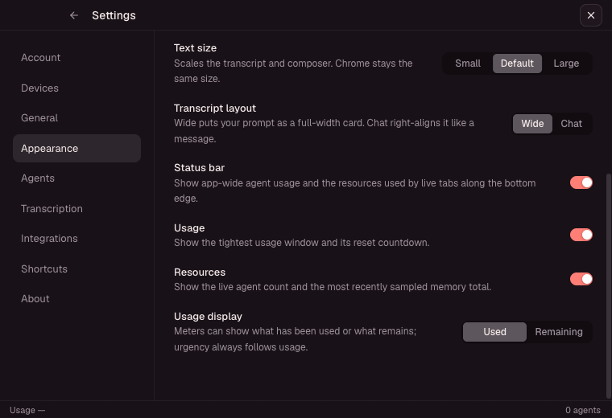
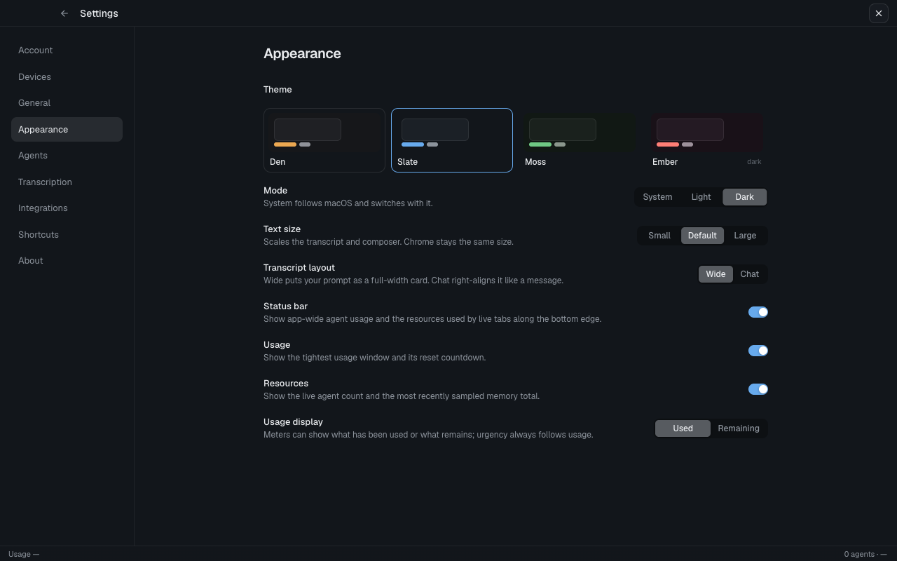
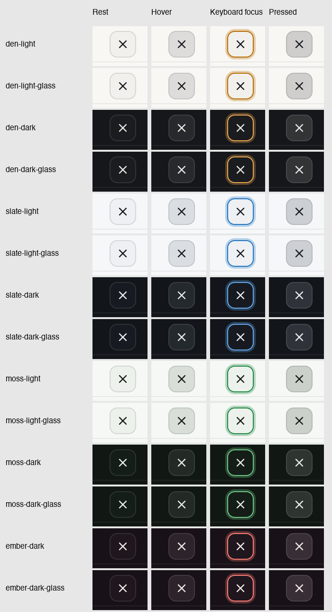

# Settings Close button verification

Issue #112 originally described a floating, transparent Close button in
`SettingsDialog`. Before this fix, Settings had already become `SettingsPage`
with a fixed Back header and no Close button. The before images show that
current baseline (`52e9740`), not the older dialog.

The fix adds a Close X to the right of the existing header and restores Escape
dismissal. It uses the existing outline Button with an opaque `surface-raised`
background, opaque theme-derived hover/pressed colors, and the primitive's
keyboard focus ring. The header stays outside the scrolling content. Shared
dialog and button styles are unchanged.

## Rendered checks

Captured the actual Vite frontend in isolated Chrome on macOS at 760 × 520
(the native app's minimum window size) and 1280 × 800. The glass cases enable
the app's `data-glass` CSS; native macOS vibrancy compositing was not exercised.

- Den, Slate, and Moss: light and dark, with and without glass.
- Ember: dark, with and without glass (the only supported mode).
- Every combination: rest, hover, keyboard focus via Tab, and pointer pressed.
  Computed background alpha was 255/255 in every state. The lowest measured
  foreground/background contrast was 10.1:1. Hover and pressed backgrounds
  differ from rest; focus shows the theme-colored ring.
- The button occupies y=4.5–32.5; the content viewport starts at y=38. Scrolling
  Appearance to the bottom at minimum size preserves that separation.
- Clicking Close and pressing Escape exit Settings. With the command palette
  open over Settings, the first Escape closes the palette and the next exits
  Settings. Back remains available.
- Theme selection and explicit Light/Dark controls work. System mode follows
  changes to the browser's emulated OS color scheme.

The state sheet contains enlarged browser screenshot crops, labeled by palette
and state. It is not a design mockup.

| Before | After |
| --- | --- |
|  |  |
|  |  |

## Automated checks

All four required repository checks passed on macOS:

- `pnpm exec tsc --noEmit`
- `pnpm vitest run` — 53 files, 296 tests, including three Settings dismissal
  tests using the real SettingsPage, shortcut registry, and Radix dialog.
- `cargo clippy --all-targets -- -D warnings`
- `cargo test`

The Settings tests failed before the implementation because Close was missing
and Escape did not dismiss the page. They cover Close/Back callbacks, Escape
handler cleanup, and giving an open dialog precedence over Settings.
