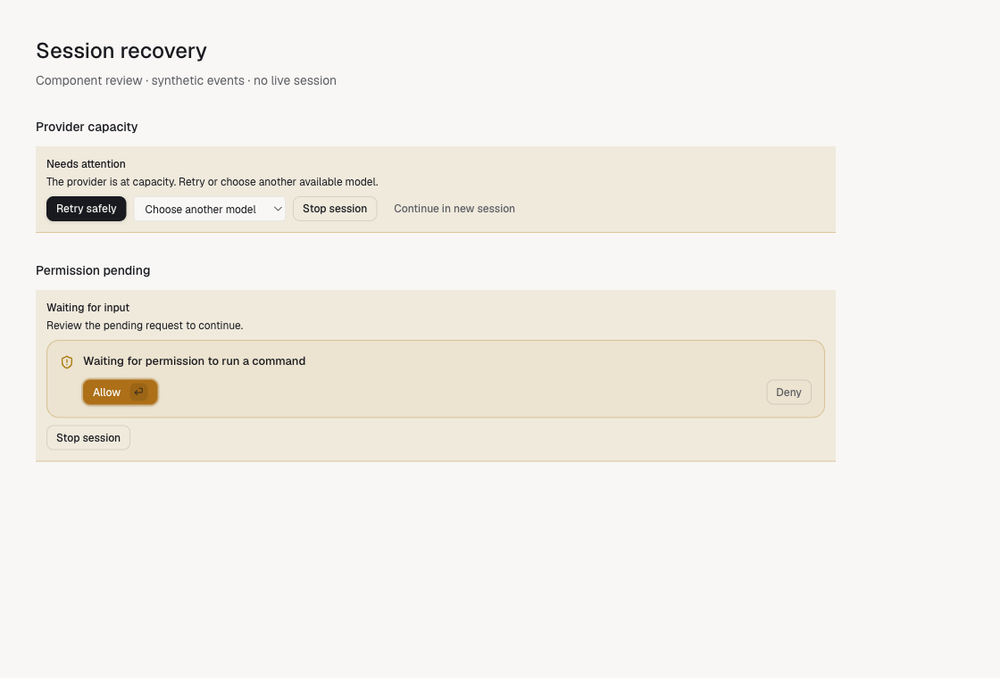
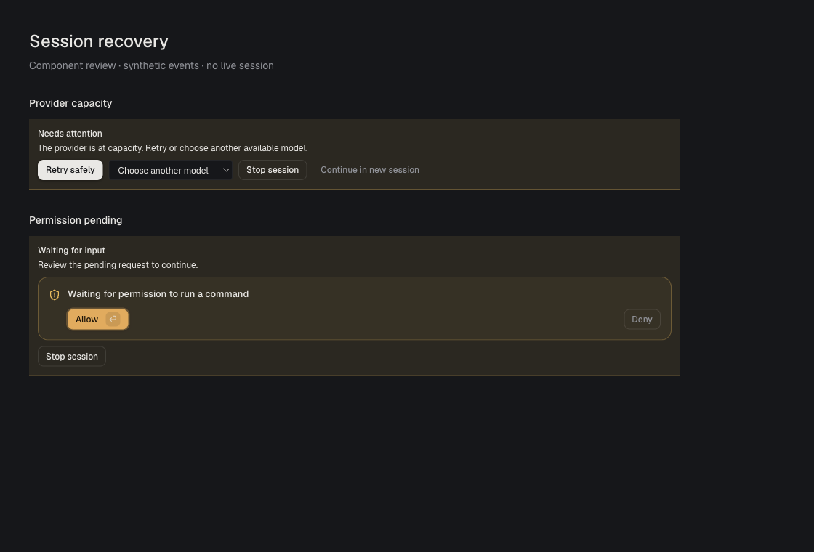

# Session recovery UI

The light and dark screenshots render the production `RecoveryBanner` and permission components with synthetic capacity and permission events. They contain no live session or account data. The temporary preview page is not shipped.

